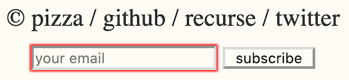

# hugo-subscription-hook

Lightweight hacky subscription form and subscription notifications for my Hugo website, www.chronicpizza.net. Everything is being run on my Raspberry Pi.


## Setup
`source ./.env && python3.7 bot.py`


## Example run

```
[subhook]: Getting subscribers...
[subhook]: Getting subscribers... Done! 1 subscribers.
[subhook]: Getting unsubscribes...
0 new emails!
[subhook]: Getting unsubscribes... Done!
[subhook]: Checking website for changes...
[subhook]: Checking website for changes... Done! 3 new posts.
[subhook]: E-mailing subscribers...
[send_emails] Emailed to mistercoolguy@ghouls.com
[subhook]: E-mailing subscribers... Done!
```

## Overview

### Subscribing
1. A user submits their email through an HTML form that is targeted towards a Google Form, which outputs information to a Google Sheet. Thanks to [developerdrive](https://www.developerdrive.com/add-google-forms-static-site/) here.
```html
<form action="<google-form-response-url>" method="post">
    <input type="email" placeholder="your email" name="emailAddress" required>
        <button type="submit">subscribe</button>
    </form>
</div>
```

2. An automated script periodically checks Google Sheets to get a list of subscribers. Thanks to [towardsdatascience](https://towardsdatascience.com/accessing-google-spreadsheet-data-using-python-90a5bc214fd2).

4. Another automated script curls my website and looks for changes.

5. If it detects any changes, it notifies the list of subscribers.

### Unsubscribing
1. A user replies to a standard subscription email
2. A script sees this reply and removes the user from the list of subscribers.
